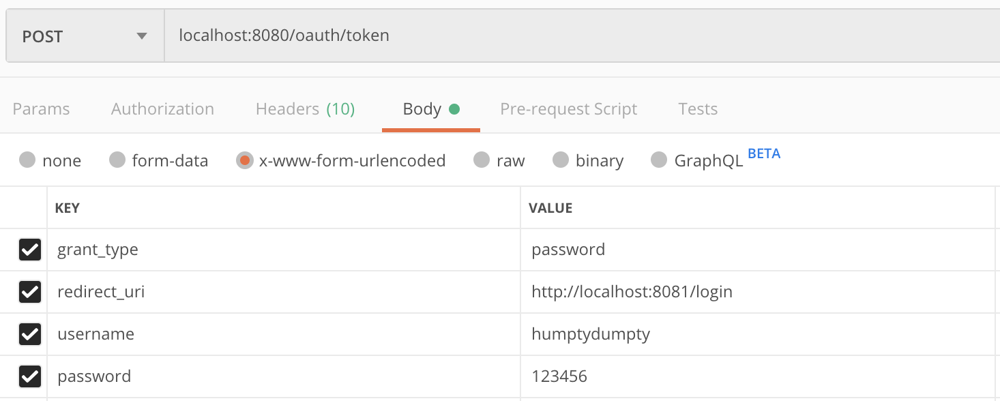

# Spring-Boot OAuth2 Setup 

This is a working Spring Boot OAuth project copied from [here](https://howtodoinjava.com/spring5/security5/oauth2-auth-server/).

## Table of Contents
- [Project Setup](#project-setup)
- Registration
    - [Registering New User](#registering-new-user-via-userregister)
- Authentication with Authorization Code
    - [Retrieving Authorization Code](#retrieving-authorization-code)
    - [Retrieving Token](#retrieving-token-through-oauthtoken)
- Authentication with Password
    - [Authentication with Password](#authentication-with-password)
- Reset Password
## Workflow

### Project Setup
1. After cloning the project open it as a maven project in your favorite IDE.

2. Run `mvn package` to install all the dependencies.

3. Start the application through your IDE's play/start button.

### Registering new user via `/user/register`
1. Create a Postman request with method set to `POST` and url to `localhost:8080/user/register`.

2. Under the `Body` tab, select `raw` and then select `JSON (application/json)` from the dropdown menu to the right.

3. In the text box field under the `Body` tab, insert the request body in the following format with the following information (replace capitalized inputs with own credentials):
    ```
    {
        "username": "USERNAME",
        "password": "PASSWORD",
        "authorities":"ROLE_1, ROLE_2, ...",
        "email":"VALID@EMAIL.COM"
    }
    ```
4. Press send button and you should receive back a JSON object with the same information that you inserted in previous step.

5. Your new user was just registered but remains disabled until email verification is confirmed.  To do so, follow link (send an empty postman `GET` request or copy the link into browser) sent to your email (written to `emailVerification.txt`)

6. Check that your new user has been registered and enabled by following the steps listed above under the `Authentication with password` header, replacing the given username and password with your new username and password.

### Retrieving Authorization Code
1. We want get authorization grant from resource owner from this URL 
    ```
    http://localhost:8080/oauth/authorize?client_id=clientapp&response_type=code&scope=read_profile_info
    ```
2. This is redirect to `localhost/8080/login` path with a login page generated by `formLogin()`.

3. Login with username `humptydumpty` and password `123456`. 
    

4. Authorize the `clientapp` to access the resource by ticking off approve and pressing the authorize button.
    

5. After pressing authorize you will be redirected to `localhost:8080/login` with a code parameter. Copy that authorization code.

    

### Retrieving Token through `/oauth/token`
1. Create a Postman request with method set to `POST` and url to `localhost:8080/ouath/token`.

2. Under the `Headers` tab add `Authorization` with value `Basic Y2xpZW50YXBwOjEyMzQ1Ng==`

    

3. Under the `Body` tab select `x-www-form-urlencoded` (this will populate a new header) and add the following key value pairs:
    - `grant_type`: `authorization_code`
    - `redirect_uri`: `localhost:8081/login`
    - `code`: the code you got from the last part

    

4. Press send button and you should get an JSON object with JWT access-token.
    

### Authentication with Password
1. Create a Postman request with method set to `POST` and url to `localhost:8080/ouath/token`.

2. Under the `Headers` tab add `Authorization` with value `Basic Y2xpZW50YXBwOjEyMzQ1Ng==`

    

3. Under the `Body` tab select `x-www-form-urlencoded` (this will populate a new header) and add the following key value pairs:
    - `grant_type`: `password`
    - `redirect_uri`: `localhost:8081/login`
    - `username`: `humptygrumpty`
    - `password`: `123456`

4. Press send button and you should get an JSON object with a JWT access-token.
    


### Reset Password

Password reset flow consists of three steps:
1. Retrieving the password reset URL in an email (currently written into a file)
2. Using the URL to access the password reset page (not built yet)
3. Filling in the password reset form on the page and resetting the password

#### Get Reset Password Token

1. For simplicity we are just passing the username to the API to get back a reset-password token in a form of an email with an URL.
    ```
        {
            username: han
        }
    ```
2. Add `Content-Type: application/json` to the header section in Postman.
3. Send a `POST` request to `localhost:8080/user/reset_password/token` to receive a token back. If the user doesn't exist the response object will say so. A successful request will return the password-reset token used in the below functionality.
#### Password Reset URL

1. This REST endpoint will be redirecting the user from an URL sent to their email for password reset.
2. To mimic the output of the password reset email the content is written to `EmailResetPasswrd.txt`
3. To go to the password reset page (not built yet) just copy the link inside `EmailResetPassword.txt` and put it in Postman GET request or a browser. If the token is valid then a placeholder redirect text will be returned. If the token is invalid the response will say so.

### Password Reset

1. This REST endpoint will respond to a user submitting a password reset form from the browser.
2. For simplicity, there is no authentication for this endpoint. In Postman we only need `Content-Type: application/json` in Header section and the following JSON object in the Body section:
    ```
        {
        	"token": "21fc22b7-0f9a-4508-a806-601e619b852d",
        	"newPassword": "passwordhan2"
        }
            
   ```
3. Press `Send` and the response should either be a successful password reset or an invalid token.