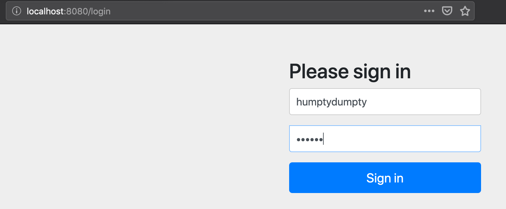
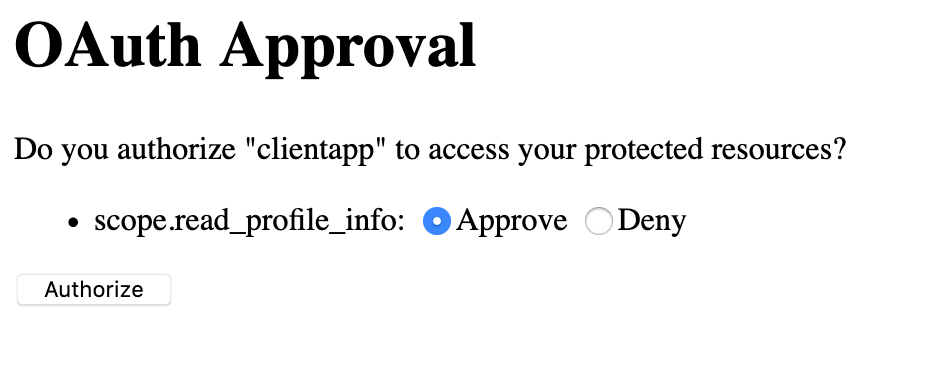

# Spring-Boot OAuth2 Setup 

This is a working Spring Boot OAuth project copied from [here](https://howtodoinjava.com/spring5/security5/oauth2-auth-server/).

## Workflow

### Project Setup
Step 1: After cloning the project open it as a maven project in your favorite IDE.

Step 2: Run `mvn package` to install all the dependencies.

Step 3: Start the application through your IDE's play/start button.

### Retrieving Authorization Code
Step 1: We want get authorization grant from resource owner from this URL 
```
http://localhost:8080/oauth/authorize?client_id=clientapp&response_type=code&scope=read_profile_info
```
Step 2: This is redirect to `localhost/8080/login` path with a login page generated by `formLogin()`.

Step 3: Login with username `humptydumpty` and password `123456`. 


Step 4: Authorize the `clientapp` to access the resource by ticking off approve and pressing the authorize button.


Step 5: After pressing authorize you will be redirected to `localhost:8080/login` with a code parameter. Copy that authorization code.


### Retrieving Token through `/oauth/token`
Step 1: Open Postman app and create a new request.

Step 2: Set method type to `POST` and url to `localhost:8080/ouath/token`.

Step 3: Under the `Headers` tab add `Authorization` with value `Basic Y2xpZW50YXBwOjEyMzQ1Ng==`


Step 4: Under the `Body` tab select `x-www-form-urlencoded` (this will populate a new header) and add the following key value pairs:
- `grant_type`: `authorization_code`
- `redirect_uri`: `localhost:8081/login`
- `code`: the code you got from the last part


Step 5: Press send button and you should get an JSON object with access-token.

